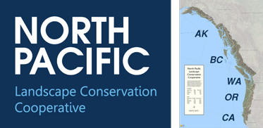

## Project 2: West Coast Animal Migratory Paths

### Overview

We have just landed our dream job at World Wide Animal Conservation as a data analyst. Our first assignment will be to study and analyze the migration paths for Rufous Hummingbird and Blue Whales in the southern portion of the North Pacific Landscape Conservation Cooperative (NPLCC) region including CA, OR and WA. 

We will be using leaflet with the [MapBox Api](https://docs.mapbox.com/) in order to call in our maps and plot the migration paths for our animals.

We will create a dashboard page with a dropdown menu that will allow for a user to select which animal migration path they would like to track. 

### Data sets

* We got our humingbird data from [data.pointblue.org](https://data.pointblue.org/apps/data_catalog/dataset/aknw-2020-002/resource/b78ce571-6300-4fac-9b08-b575b592840c).

* We got our data for the Monarch Butterfly's migration path from [catalog.data.gov](https://catalog.data.gov/dataset/monarch-butterfly-habitat-restoration-polygon-feature-layer-6ecf8).

* We got our data for the blue whales migration path from [datarepository.movebank.org](https://www.datarepository.movebank.org/handle/10255/move.837).
